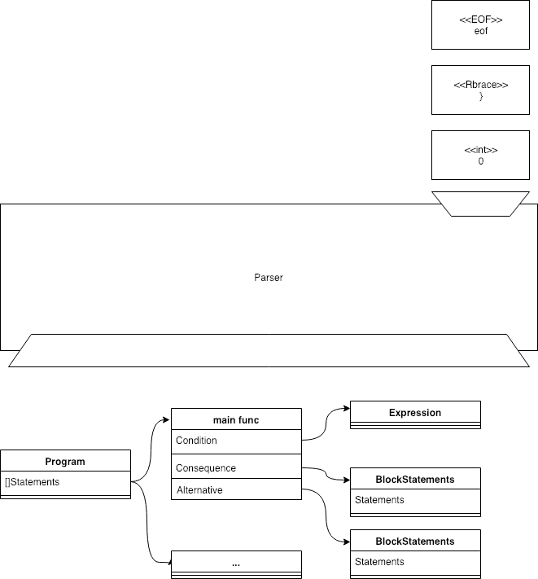

# Koa

The project is inspired by [the simplicity](https://blockstream.com/simplicity.pdf) and the [ivy-bitcoin](https://github.com/ivy-lang/ivy-bitcoin).

The koa project is to create a high-level language that has `more expressions` than the bitcoin script.

### Lexical analysis

The first step in the compiler is `lexical analysis` or `scanning`. Lexical analysis reads the stream of characters that make up the source code and groups these letters into a "meaningful permutation" form called lexemes. The lexical analyzer takes each lexeme as a `token` and passes it to the next step, syntax analysis(parser). (For reference, the` lexical analyzer` is simply abbreviated as `lexer`)

### Syntax analysis

#### Concept

Syntax analysis reads the stream of `token` which is generated by `lexer`, then make AST(Abstract Synstax Tree) which is passed to compiler.  Koa parser is 'Pratt parser' which is easy to make, modulable and scalable. **The main idea of 'Pratt parser' is each `token` has its own parsing functions.** (infix parsing function, prefix parsing function). In the above diagram `Program` denotes root node of AST and AST consists of slice of `Statements`.

### Virtual Machine

#### Basic Architecture

#### Execution Model

